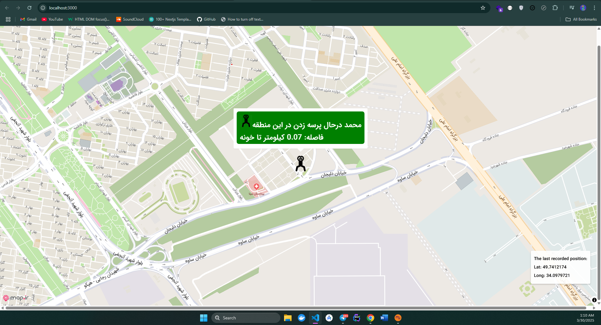

# MomTracker

## About the Project

Every night, my mom asks me:  
"Where are you going?"  
"Why are you coming back so late?"  

To make things easier for both of us, I created **MomTracker**. This project allows me to share my location in real-time, calculate how far I am from home, and display it on a map. Now, instead of asking me, she can just check the app and see where I am.


## Features

- **Real-Time Location Tracking**: Fetches and displays the latest location every 5 seconds.
- **Distance Calculation**: Calculates the distance between my current location and home and displays it in a popup on the map.
- **Location History**: Stores all location data in a JSON file for future reference.
- **Interactive Map**: Uses `mapir-react-component` for a smooth and interactive map experience.
- **Server Integration**: A simple Express.js server handles saving and retrieving location data.

## Why MomTracker?

This project is a fun and practical way to keep my mom updated about my whereabouts while giving me some peace of mind during my nightly adventures. It's a win-win!

## How It Works

1. **Frontend**:
   - Built with React.
   - Displays the map and a popup with my name and the distance to home.
   - Fetches the latest location from the server every 5 seconds.

2. **Backend**:
   - Built with Express.js.
   - Saves location data to a JSON file (`locations.json`).
   - Provides APIs to save and retrieve location data.

3. **Distance Calculation**:
   - Uses the Haversine formula to calculate the distance between my current location and home.

## Why Not Socket.IO?

Although `socket.io` is a great tool for real-time communication, I decided not to use it in this project for personal reasons. I wanted to keep things simple and focus on periodic updates using REST APIs. Plus, I just didn't feel like using `socket.io` this time—sometimes, you just want to do things differently!

## How to Run

1. Clone the repository:
   ```bash
   git clone https://github.com/your-repo/momtracker.git
   cd momtracker
   ```

2. Install dependencies:
   ```bash
   npm install
   ```

3. Start the server:
   ```bash
   npm run server
   ```

4. Start the React app:
   ```bash
   npm start
   ```

5. Open your browser and navigate to:
   ```
   http://localhost:3000
   ```

## Tech Stack

- **Frontend**: React, `mapir-react-component`
- **Backend**: Express.js
- **Data Storage**: JSON file (`locations.json`)

## Screenshots

### Demo and Popup with Distance feature


## Future Plans

- Add a feature to notify my mom when I reach home.
- Improve the UI with more animations and better styling.
- Add a mobile app version for easier tracking.

---

**Disclaimer**: This project is just for fun and personal use. It's not meant to be a professional-grade tracking solution. 😊